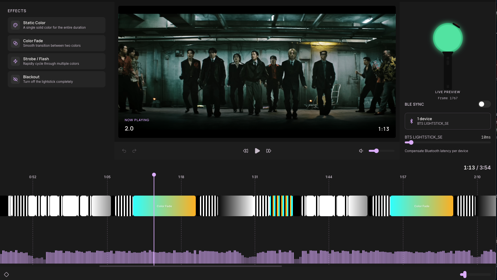

<p align="center">
  
</p>

<h1 align="center">ArmySync</h1>

<p align="center">
  Desktop app to sync BTS Army Bomb lightstick effects with video playback.
</p>

---

<p align="center">
  
</p>

## Features

- **Timeline Editor** — Drag-and-drop effect editor with real-time preview, undo/redo, copy/paste, and multi-select
- **4 Effect Types** — Static Color, Color Fade, Strobe/Flash (BPM-based with tap sync), and Blackout
- **Video Sync** — Load local videos or download from YouTube, with waveform visualization
- **Lightstick Preview** — Simulated Army Bomb with glow that reflects effects in real-time at 60Hz
- **BLE Lightstick Control** — Connect real Army Bombs (V4, V3, SE, Multi) via Bluetooth with per-device latency compensation
- **Project Management** — Folder-based projects with manifest, recent projects list, and auto-save

## How to Use

1. **Create a project** — Click "New Project" on the home screen, pick a folder, choose a video source (local file or YouTube URL)
2. **Add effects** — Drag effects from the left palette onto the timeline
3. **Edit effects** — Click an effect on the timeline to open its properties panel, adjust colors, duration, BPM, etc.
4. **Preview** — Hit play to watch the video with the lightstick preview updating in real-time
5. **Connect a lightstick** — Enable BLE Sync in the right panel, tap the device button, scan and connect your Army Bomb
6. **Calibrate delay** — Use the per-device delay slider (0-200ms) to compensate Bluetooth latency
7. **Save** — Effects auto-save, or press `Cmd+S` to save manually

## Keyboard Shortcuts

| Key | Action |
|-----|--------|
| `Space` | Play / Pause |
| `←` / `→` | Seek backward / forward |
| `Shift + ←` / `→` | Seek by larger step |
| `↑` / `↓` | Volume up / down |
| `Cmd+Z` | Undo |
| `Cmd+Shift+Z` | Redo |
| `Cmd+C` / `Cmd+V` | Copy / Paste effect |
| `Cmd+D` | Duplicate effect |
| `Delete` / `Backspace` | Delete selected effect |
| `Cmd+S` | Save |

## Tech Stack

- [Tauri 2](https://tauri.app) — Desktop runtime (Rust backend)
- [React 19](https://react.dev) — UI framework
- [Tailwind CSS v4](https://tailwindcss.com) — Styling
- [Vite](https://vitejs.dev) — Bundler
- [TypeScript](https://www.typescriptlang.org) — Type safety
- [Zustand](https://zustand.docs.pmnd.rs) — State management
- [btleplug](https://github.com/deviceplug/btleplug) — Cross-platform BLE (Rust)
- [Symphonia](https://github.com/pdeljanov/symphonia) — Audio waveform extraction (Rust)

## Prerequisites

- [Node.js](https://nodejs.org) (v18+)
- [pnpm](https://pnpm.io)
- [Rust](https://www.rust-lang.org/tools/install)
- [yt-dlp](https://github.com/yt-dlp/yt-dlp) (for YouTube video downloads)

## Getting Started

```bash
pnpm install
pnpm tauri dev
```

## Scripts

| Command | Description |
|---------|-------------|
| `pnpm dev` | Start Vite dev server |
| `pnpm tauri dev` | Start Tauri app in dev mode |
| `pnpm build` | Build for production |
| `pnpm lint` | Run ESLint |
| `pnpm lint:fix` | Run ESLint with auto-fix + Prettier |
| `pnpm type-check` | TypeScript type checking |
| `pnpm check` | Run all checks |

## License

[AGPL-3.0](LICENSE)
